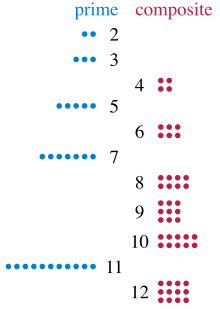

# Prime number

A **prime number** is a natural number greater than 1 that cannot be formed by multiplying two smaller natural numbers. A natural number greater than 1 that is not prime is called a **composite number**.两个概念：prime number和composite number

For example, 5 is prime because the only ways of writing it as a product, `1 × 5` or `5 × 1`, involve 5 itself. However, 6 is composite because it is the product of two numbers (`2 × 3`) that are both smaller than 6.举例

**Primes** are central in **number theory** because of the fundamental theorem of arithmetic: **every natural number greater than 1 is either a prime itself or can be factorized as a product of primes that is unique up to their order**.

> The prime numbers are the natural numbers greater than one that are not products of two smaller natural numbers.

prime number，中文为“质数”，又称“素数”

第一个问题：质数有多少个？ 答：无穷个

第二个问题：1是不是素数？

第三个问题：如何判断一个数是不是素数？怎么把素数找出来呢？

埃拉托斯特尼筛法，所使用的原理是從2開始，將每個質數的各個倍數，標記成合數。一個質數的各個倍數，是一個差為此質數本身的等差數列。此為這個篩法和試除法不同的關鍵之處，後者是以質數來測試每個待測數能否被整除。

第四个问题，素数的分布是否存在规律呢？

这个问题，从古至今一直困扰着无数数学家的问题，也引发了一系列的著名猜想，有哥德巴赫猜想、孪生素数猜想、黎曼猜想。大致一看，所有的素数应该是不能写成一个通式。人们退而求其次，既然不能将所有的素数用一个通式来表示，那么能不能有一个特定的通式所表示的一定是素数呢？

x/lnx这个素数的分布函数，现在也被称作素数定理。

## Mersenne prime 梅森素数

梅森數是指形如2n-1的數，記為Mn；如果一個梅森數是質數那麼它稱為梅森質數（英語：Mersenne prime）。

梅森數是根據17世紀法國數學家馬蘭·梅森（Marin Mersenne）的名字命名的，他列出了n ≤ 257的梅森質數，不過他錯誤地包括了不是梅森質數的M67和M257，而遺漏了M61、M89和M107。

目前，梅森素数只发现了50个。有一个问题：梅森素数是否存在某种规律呢？

## Riemann hypothesis 黎曼猜想

黎曼猜想（英語：Riemann hypothesis，RH）由德國數學家波恩哈德·黎曼於1859年提出。它是數學中一個重要而又著名的未解決的問題，有「猜想界皇冠」之稱，多年來它吸引了許多出色的數學家為之絞盡腦汁。

黎曼猜想，也是对“素数分布”的研究，就是在n以内有多少个素数。

