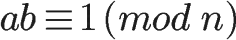

# RSA

## 费马小定理

1636年，费马说：假设a是一个整数，p是一个素数，那么ap-a一定是p的倍数。

版本一：

ap - a = p的倍数

ap≡a (mod p)

其中，三个横表示“同余”

版本二：

ap - a = p的倍数

变换：a(ap-1 - 1) = p的倍数

上面，如果a不是p的倍数，那么(ap-1 - 1)一定是p的倍数，又可以写成

ap-1 - 1 = p的倍数

写成同余的形式：

ap-1 ≡ 1 (mod p)

## 欧拉φ函数

φ(n)就表示了在小于或等于n的正整数当中，与n互素的数的个数。

- 如果n是素数，那么φ(n)=n-1
- 如果m和n互素，那φ(mn)=φ(m)φ(n)

1736年（时隔100年后），欧拉开始证明“费马小定理”：费马小定理，确实对，但不够一般化，欧拉给出了一个更一般化的定理，叫作“费马-欧拉定理”。

在“费马小定理”中，a是一个整数，p是一个素数，那么ap-a一定是p的倍数。

在“费马-欧拉定理”中，a是一个整数，n是一个整数（注意这里不要求是“素数”了），但要求a和n互质，那么aφ(n)-1一定是n的倍数。

“费马-欧拉定理”，写成同余的形式就是：

aφ(n) ≡ 1 (mod n)

当n是素数的时候，φ(n)=n-1，上面的式子就变成an-1 ≡ 1 (mod n)，正好是“费马小定理”。

## 模逆元

如果两个正整数`a`和`n`互质，那么一定可以找到整数`b`，使得`ab-1`被`n`整除，或者说`ab`被`n`除的余数是`1`。

这时，b就叫做a的"**模反元素**"。
