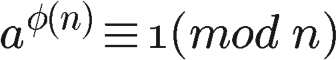
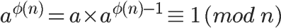

# RSA

<!-- TOC -->

- [1. 一点历史](#1-%e4%b8%80%e7%82%b9%e5%8e%86%e5%8f%b2)
- [2. 互质关系](#2-%e4%ba%92%e8%b4%a8%e5%85%b3%e7%b3%bb)
- [3. 欧拉函数](#3-%e6%ac%a7%e6%8b%89%e5%87%bd%e6%95%b0)
  - [3.1. 第一种情况](#31-%e7%ac%ac%e4%b8%80%e7%a7%8d%e6%83%85%e5%86%b5)
  - [3.2. 第二种情况](#32-%e7%ac%ac%e4%ba%8c%e7%a7%8d%e6%83%85%e5%86%b5)
  - [3.3. 第三种情况](#33-%e7%ac%ac%e4%b8%89%e7%a7%8d%e6%83%85%e5%86%b5)
  - [3.4. 第四种情况](#34-%e7%ac%ac%e5%9b%9b%e7%a7%8d%e6%83%85%e5%86%b5)
  - [3.5. 第五种情况](#35-%e7%ac%ac%e4%ba%94%e7%a7%8d%e6%83%85%e5%86%b5)
- [4. 欧拉定理](#4-%e6%ac%a7%e6%8b%89%e5%ae%9a%e7%90%86)
- [5. 模反元素](#5-%e6%a8%a1%e5%8f%8d%e5%85%83%e7%b4%a0)
- [6. 密钥生成的步骤](#6-%e5%af%86%e9%92%a5%e7%94%9f%e6%88%90%e7%9a%84%e6%ad%a5%e9%aa%a4)
- [7. RSA算法的可靠性](#7-rsa%e7%ae%97%e6%b3%95%e7%9a%84%e5%8f%af%e9%9d%a0%e6%80%a7)
- [8. 加密和解密](#8-%e5%8a%a0%e5%af%86%e5%92%8c%e8%a7%a3%e5%af%86)
- [9. 私钥解密的证明](#9-%e7%a7%81%e9%92%a5%e8%a7%a3%e5%af%86%e7%9a%84%e8%af%81%e6%98%8e)
- [10. RSA Encryption Implementation using BigInteger Class](#10-rsa-encryption-implementation-using-biginteger-class)
  - [10.1. Public key generation:](#101-public-key-generation)
  - [10.2. Message encryption with public key:](#102-message-encryption-with-public-key)
  - [10.3. Ciphertext decryption with private key:](#103-ciphertext-decryption-with-private-key)
- [11. Cast of characters](#11-cast-of-characters)
- [12. Reference](#12-reference)

<!-- /TOC -->

## 1. 一点历史

1976年以前，所有的加密方法都是同一种模式：

- （1）甲方选择某一种加密规则，对信息进行加密；
- （2）乙方使用同一种规则，对信息进行解密。

由于**加密**和**解密**使用同样规则（简称"密钥"），这被称为"对称加密算法"（Symmetric-key algorithm）。

这种加密模式有一个最大弱点：甲方必须把**加密规则**告诉乙方，否则无法解密。保存和传递密钥，就成了最头疼的问题。


1976年，两位美国计算机学家Whitfield Diffie 和 Martin Hellman，提出了一种崭新构思，可以在不直接传递密钥的情况下，完成解密。这被称为"Diffie-Hellman密钥交换算法"。这个算法启发了其他科学家。人们认识到，**加密和解密可以使用不同的规则，只要这两种规则之间存在某种对应关系即可，这样就避免了直接传递密钥**。

这种新的加密模式被称为"非对称加密算法"。

- （1）Alice生成两把密钥（公钥和私钥）。公钥是公开的，任何人都可以获得，私钥则是保密的。
- （2）Bob获取Alice的公钥，然后用它对信息加密。
- （3）Alice得到加密后的信息，用私钥解密。

如果公钥加密的信息只有私钥解得开，那么只要私钥不泄漏，通信就是安全的。


1977年，三位数学家Rivest、Shamir 和 Adleman 设计了一种算法，可以实现非对称加密。这种算法用他们三个人的名字命名，叫做RSA算法。从那时直到现在，RSA算法一直是最广为使用的"非对称加密算法"。毫不夸张地说，只要有计算机网络的地方，就有RSA算法。

这种算法非常可靠，密钥越长，它就越难破解。根据已经披露的文献，目前被破解的最长RSA密钥是768个二进制位。也就是说，长度超过768位的密钥，还无法破解（至少没人公开宣布）。因此可以认为，1024位的RSA密钥基本安全，2048位的密钥极其安全。

下面，我就进入正题，解释RSA算法的原理。文章共分成两部分，今天是第一部分，介绍要用到的四个数学概念。你可以看到，RSA算法并不难，只需要一点**数论知识**就可以理解。

## 2. 互质关系

如果两个正整数，除了1以外，没有其他公因子，我们就称这两个数是**互质关系**（coprime）。比如，15和32没有公因子，所以它们是互质关系。这说明，不是质数也可以构成互质关系。

关于互质关系，不难得到以下结论：

- (1) 任意两个质数构成互质关系，比如13和61。
- (2) 一个数是质数，另一个数只要不是前者的倍数，两者就构成互质关系，比如3和10。
- (3) 如果两个数之中，较大的那个数是质数，则两者构成互质关系，比如97和57。
- (4) 1和任意一个自然数是都是互质关系，比如1和99。
- (5) p是大于1的整数，则p和p-1构成互质关系，比如57和56。
- (6) p是大于1的奇数，则p和p-2构成互质关系，比如17和15。

## 3. 欧拉函数

请思考以下问题：

任意给定正整数n，请问在小于等于n的正整数之中，有多少个与n构成互质关系？（比如，在1到8之中，有多少个数与8构成互质关系？）

计算这个值的方法就叫做**欧拉函数**，以`φ(n)`表示。在1到8之中，与8形成互质关系的是1、3、5、7，所以`φ(8) = 4`。

> 我的理解：欧拉函数，是在“互质关系”的概念基础上构建起来的。  
> 它的思路是这样的：  
> 首先，选择一个自然数n。  
> 其次，提出两个假设，第一个是`1<=k<=n`；第二个是k和n构成互质关系。  
> 最后，它并不是求解出k的具体值是多少，而是求解k有多少个可能取值。

φ(n) 的计算方法并不复杂，但是为了得到最后那个公式，需要一步步讨论。

### 3.1. 第一种情况

如果n=1，则`φ(1) = 1`。因为1与任何数（包括自身）都构成互质关系。

> 接下来的讨论，是从两个角度来进行的，一个就是“质数”，另一个就是“合数”

### 3.2. 第二种情况

如果n是质数，则`φ(n)=n-1`。因为质数与小于它的每一个数，都构成互质关系。比如5与1、2、3、4都构成互质关系。

> 这里讨论的就是“质数”

### 3.3. 第三种情况

如果n是质数的某一个次方，即`n = p^k`(`p`为质数，`k`为大于等于1的整数)，则


比如 `φ(8) = φ(2^3) =2^3 - 2^2 = 8 - 4 = 4`。

这是因为只有当一个数不包含质数p，才可能与n互质。而包含质数p的数一共有`p^(k-1)`个，即1×p、2×p、3×p、...、p^(k-1)×p，把它们去除，剩下的就是与n互质的数。

> 这里，我不太明白，它（`p^(k-1)`）究竟是怎么算出来的

上面的式子还可以写成下面的形式：


> 严格的来说，这里讨论的是“合数”，但它们是一些特殊情况，特殊之处就在于：它虽然是合数，但它是“质数”的多少次方，在一定程度上，它又与“质数”有某种关系。

可以看出，上面的第二种情况是 k=1 时的特例。

### 3.4. 第四种情况

如果n可以分解成两个互质的整数之积，

```txt
n = p1 × p2
```

则

```txt
φ(n) = φ(p1p2) = φ(p1)φ(p2)
```

即积的欧拉函数等于各个因子的欧拉函数之积。比如，φ(56)=φ(8×7)=φ(8)×φ(7)=4×6=24。

这一条的证明要用到"中国剩余定理"，这里就不展开了，只简单说一下思路：如果`a`与`p1`互质`(a<p1)`，`b`与`p2`互质`(b<p2)`，`c`与`p1p2`互质`(c<p1p2)`，则`c`与数对 `(a,b)`是一一对应关系。由于`a`的值有`φ(p1)`种可能，`b`的值有`φ(p2)`种可能，则数对 `(a,b)` 有`φ(p1)φ(p2)`种可能，而`c`的值有`φ(p1p2)`种可能，所以`φ(p1p2)`就等于`φ(p1)φ(p2)`。

### 3.5. 第五种情况

因为任意一个大于1的正整数，都可以写成一系列质数的积。


根据第4条的结论，得到


再根据第3条的结论，得到


也就等于


这就是欧拉函数的通用计算公式。比如，1323的欧拉函数，计算过程如下：


## 4. 欧拉定理

欧拉函数的用处，在于欧拉定理。"欧拉定理"指的是：

> 互质关系-->欧拉函数-->欧拉定理

如果两个正整数`a`和`n`互质，则`n`的欧拉函数`φ(n)` 可以让下面的等式成立：



也就是说，`a`的`φ(n)`次方被`n`除的余数为`1`。或者说，`a`的`φ(n)`次方减去`1`，可以被`n`整除。比如，3和7互质，而`7`的欧拉函数`φ(7)`等于`6`，所以3的6次方（729）减去1，可以被7整除（728/7=104）。

欧拉定理的证明比较复杂，这里就省略了。我们只要记住它的结论就行了。

欧拉定理可以大大简化某些运算。比如，7和10互质，根据欧拉定理，


已知`φ(10)`等于4，所以马上得到7的4倍数次方的个位数肯定是1。


因此，7的任意次方的个位数（例如7的222次方），心算就可以算出来。

欧拉定理有一个特殊情况。

假设正整数`a`与质数`p`互质，因为质数`p`的`φ(p)`等于`p-1`，则欧拉定理可以写成


这就是著名的**费马小定理**。它是欧拉定理的特例。

欧拉定理是RSA算法的核心。理解了这个定理，就可以理解RSA。

## 5. 模反元素

还剩下最后一个概念：

如果两个正整数`a`和`n`互质，那么一定可以找到整数`b`，使得`ab-1`被`n`整除，或者说`ab`被`n`除的余数是`1`。


这时，b就叫做a的"**模反元素**"。

比如，3和11互质，那么3的模反元素就是4，因为 (3 × 4)-1 可以被11整除。显然，模反元素不止一个，4加减11的整数倍都是3的模反元素 {...,-18,-7,4,15,26,...}，即如果b是a的模反元素，则`b+kn`都是a的模反元素。

欧拉定理可以用来证明模反元素必然存在。



可以看到，`a`的`φ(n)-1`次方，就是`a`的模反元素。

## 6. 密钥生成的步骤

我们通过一个例子，来理解RSA算法。假设Alice要与Bob进行加密通信，她该怎么生成公钥和私钥呢？

第一步，随机选择两个不相等的质数`p`和`q`。

Alice选择了61和53。（实际应用中，这两个质数越大，就越难破解。）

第二步，计算`p`和`q`的乘积`n`。

Alice就把61和53相乘。

```txt
n = 61×53 = 3233
```

n表示成二进制的长度就是密钥长度。3233写成二进制是110010100001，一共有12位，所以这个密钥就是12位。实际应用中，RSA密钥一般是1024位，重要场合则为2048位。

第三步，计算`n`的欧拉函数`φ(n)`。

根据公式：

```txt
φ(n) = (p-1)(q-1)
```

Alice算出φ(3233)等于60×52，即3120。

第四步，随机选择一个整数`e`，条件是`1< e < φ(n)`，且`e`与`φ(n)`互质。

Alice就在1到3120之间，随机选择了17。（实际应用中，常常选择65537。）

第五步，计算`e`对于`φ(n)`的模反元素`d`。

所谓"模反元素"就是指有一个整数`d`，可以使得`ed`被`φ(n)`除的余数为1。

```txt
ed ≡ 1 (mod φ(n))
```

这个式子等价于

```txt
ed - 1 = kφ(n)
```

于是，找到模反元素d，实质上就是对下面这个二元一次方程求解。

```txt
ex + φ(n)y = 1
```

已知 e=17, φ(n)=3120，

```txt
17x + 3120y = 1
```

这个方程可以用"扩展欧几里得算法"求解，此处省略具体过程。总之，Alice算出一组整数解为 (x,y)=(2753,-15)，即 d=2753。

至此所有计算完成。

第六步，将n和e封装成公钥，n和d封装成私钥。

在Alice的例子中，n=3233，e=17，d=2753，所以公钥就是 (3233,17)，私钥就是（3233, 2753）。

## 7. RSA算法的可靠性

回顾上面的密钥生成步骤，一共出现六个数字：

```txt
p
q
n
φ(n)
e
d
```

这六个数字之中，公钥用到了两个（`n`和`e`），其余四个数字都是不公开的。其中最关键的是`d`，因为`n`和`d`组成了私钥，一旦`d`泄漏，就等于私钥泄漏。

那么，有没有可能在已知n和e的情况下，推导出d？

```txt
（1）ed≡1 (mod φ(n))。只有知道e和φ(n)，才能算出d。
（2）φ(n)=(p-1)(q-1)。只有知道p和q，才能算出φ(n)。
（3）n=pq。只有将n因数分解，才能算出p和q。
```

结论：**如果n可以被因数分解，d就可以算出，也就意味着私钥被破解**。

可是，大整数的因数分解，是一件非常困难的事情。目前，除了暴力破解，还没有发现别的有效方法。维基百科这样写道：

```txt
"对极大整数做因数分解的难度决定了RSA算法的可靠性。换言之，对一极大整数做因数分解愈困难，RSA算法愈可靠。

假如有人找到一种快速因数分解的算法，那么RSA的可靠性就会极度下降。但找到这样的算法的可能性是非常小的。今天只有短的RSA密钥才可能被暴力破解。到2008年为止，世界上还没有任何可靠的攻击RSA算法的方式。

只要密钥长度足够长，用RSA加密的信息实际上是不能被解破的。"
```

## 8. 加密和解密

有了公钥和密钥，就能进行加密和解密了。

（1）加密要用公钥 (n,e)

假设Bob要向Alice发送加密信息m，他就要用Alice的公钥 (n,e) 对m进行加密。这里需要注意，m必须是整数（字符串可以取ascii值或unicode值），且m必须小于n。

所谓"加密"，就是算出下式的c：m<sup>e</sup> ≡ c (mod n)

Alice的公钥是 (3233, 17)，Bob的m假设是65，那么可以算出下面的等式：65<sup>17</sup> ≡ 2790 (mod 3233)

于是，c等于2790，Bob就把2790发给了Alice。

（2）解密要用私钥(n,d)

Alice拿到Bob发来的2790以后，就用自己的私钥(3233, 2753) 进行解密。可以证明，下面的等式一定成立：

c<sup>d</sup> ≡ m (mod n)

也就是说，c的d次方除以n的余数为m。现在，c等于2790，私钥是(3233, 2753)，那么，Alice算出

2790<sup>2753</sup> ≡ 65 (mod 3233)

因此，Alice知道了Bob加密前的原文就是65。

至此，"加密--解密"的整个过程全部完成。

我们可以看到，如果不知道d，就没有办法从c求出m。而前面已经说过，要知道d就必须分解n，这是极难做到的，所以RSA算法保证了通信安全。

你可能会问，公钥(n,e) 只能加密小于n的整数m，那么如果要加密大于n的整数，该怎么办？有两种解决方法：一种是把长信息分割成若干段短消息，每段分别加密；另一种是先选择一种"对称性加密算法"（比如DES），用这种算法的密钥加密信息，再用RSA公钥加密DES密钥。

## 9. 私钥解密的证明

最后，我们来证明，为什么用私钥解密，一定可以正确地得到m。也就是证明下面这个式子：

c<sup>d</sup> ≡ m (mod n)

因为，根据加密规则

ｍ<sup>e</sup> ≡ c (mod n)

于是，c可以写成下面的形式：

c = m<sup>e</sup> - kn

将c代入要我们要证明的那个解密规则：

(m<sup>e</sup> - kn)<sup>d</sup> ≡ m (mod n)

它等同于求证

m<sup>ed</sup> ≡ m (mod n)

由于

ed = hφ(n)+1

将ed代入：

m<sup>hφ(n)+1</sup> ≡ m (mod n)

## 10. RSA Encryption Implementation using BigInteger Class

Using methods provided in the `java.math.BigInteger` class, We can implement RSA public key encryption algorithm in Java. Here is the outline of the implementation logic:

### 10.1. Public key generation:

- Call `probablePrime()` method to generate a prime number, `p`.
- Call `probablePrime()` method to generate another prime number, `q`.
- Compute the **modulus**, `n`, as `p*q`.
- Compute the Euler's totient value, `m`, as `(p-1)*(q-1)`.
- Find a public key, `e`, until `m.gcd(e)==1`.
- Find a private key, `d`, using `e.modInverse(m)`.

### 10.2. Message encryption with public key:

- Divide original message into a sequence of blocks.
- Encrypt each block, `M`, using `C = M.modPow(e,n)`.

### 10.3. Ciphertext decryption with private key:

- Divide ciphertext into a sequence of blocks.
- Decrypt each block, `C`, using `M = C.modPow(d,n)`.

## 11. Cast of characters

The most common characters are **Alice** and **Bob**.

- **Alice** and **Bob**. The original, generic characters. Generally, Alice and Bob want to exchange a message or cryptographic key.
- **Carol**, **Carlos** or **Charlie**. A generic third participant.
- **Dan**, **Dave** or **David**. A generic fourth participant.
- **Eve**. An eavesdropper(窃听者), who is usually a passive attacker. While they can listen in on messages between **Alice** and **Bob**, they cannot modify them.

## 12. Reference

- [阮一峰 RSA算法原理（一）](http://www.ruanyifeng.com/blog/2013/06/rsa_algorithm_part_one.html)
- [阮一峰 RSA算法原理（二）](http://www.ruanyifeng.com/blog/2013/07/rsa_algorithm_part_two.html)
- [Youtube: Public Key Cryptography: RSA Encryption Algorithm](https://www.youtube.com/watch?v=wXB-V_Keiu8&t=639s) 这是视频，让我觉得的好的地方在于，它用颜色中的“补色”来相应的解释“RSA的公钥和私钥”所起的作用，很形象的例子。
- [Wiki: 愛麗絲與鮑伯](https://zh.wikipedia.org/wiki/%E6%84%9B%E9%BA%97%E7%B5%B2%E8%88%87%E9%AE%91%E4%BC%AF)和[Wiki: Alice and Bob](https://en.wikipedia.org/wiki/Alice_and_Bob)，这里讲述了密码学中常出现的人物的名字，例如：Alice和Bob。

> 这个世界上，总是有一些自己无法理解的“奥妙”，即使内心感觉到痛苦，也还是没有什么办法去理解它。过去和现在，我都会想以一种能够用“现实生活中的常见的事物”来帮助理解“这些抽象的奥妙”，然而却总是想不通，也常常觉得痛苦。或许，我应该改变自己的思维模式，试着这样理解：那本来就是宇宙中存着的奥妙之处，非我所能理解其中的原理，我能做的就是熟悉它，然后善用它，这样就足够了；想要理解它，或许只是自己的一种奢望而已。
